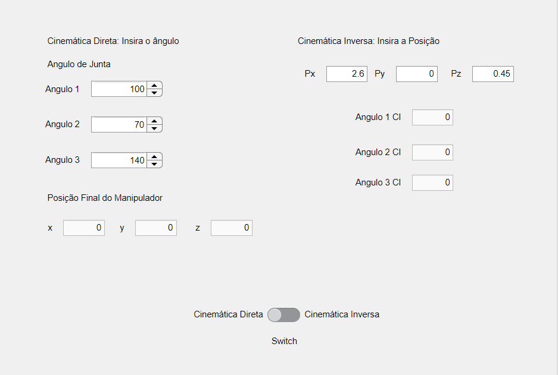

# Robotics Report - Robot Kinematics

This project is a detailed study on robot kinematics, focusing on robot assembly and the definition of Denavit parameters. The project was developed as part of the Electrical Engineering course at the JOINVILLE CAMPUS of the FEDERAL INSTITUTE OF EDUCATION, SCIENCE, AND TECHNOLOGY OF SANTA CATARINA.

## Overview

- **Institution:** FEDERAL INSTITUTE OF EDUCATION, SCIENCE AND TECHNOLOGY OF SANTA CATARINA
- **Course:** Electrical Engineering Degree
- **Subject:** Robotics
- **Student:** Elias Anzini Junior
- **Semester:** 2023/1

## Content

1. **Robot Assembly:** Details about the physical assembly of the robot.
2. **Definition of Denavit Parameters:** Description of the parameters considering a specific initial position.
3. **Programming:** Implementation carried out in MATLAB's app design, using specific libraries for communication with Arduino and for creating a virtual robot.
   - **Direct Kinematics:** Description of the process when the joint angle is changed by the user.
   - **Inverse Kinematics:** Description of the process when the manipulator's position is changed.

## Tools and Technologies

- **MATLAB:** Used for all programming and simulation.
- **Arduino:** Used for communication and robot control.

## Contributions

Contributions to improve the project are welcome. Feel free to open an issue or submit a pull request.

## Contact

For questions, suggestions, or feedback, please contact:
- Elias Anzini Junior: [eliasanzinijlle@outlook.com](mailto:eliasanzinijlle@outlook.com)

# Results

